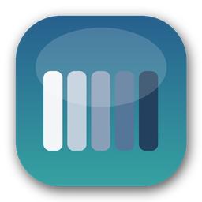

<p align="center">
  
</p>

<h1 align="center">pfsPalettes</h1>

<p align="center">
  <strong>A lightweight floating color palette utility for macOS</strong>
</p>

<p align="center">
  
  
  
  
</p>

---

## ✨ Features

| Feature | Description |
|---------|-------------|
| 🎨 **Floating Window** | Always-on-top palette that stays visible while you work |
| 📋 **One-Click Copy** | Click any swatch to instantly copy its hex code |
| 🔄 **Smart Sorting** | Sort colors by brightness or group by hue family |
| 🎯 **Color Sampling** | Intelligently select balanced color subsets from large palettes |
| 🌗 **Tint/Shade Generator** | Create lighter or darker variations of your palette with a slider |
| ⭐ **Favorites** | Star palettes and individual colors for quick access |
| 📁 **19 Built-in Palettes** | Nature series, Atlas, and more ready to use |
| 🔌 **Import/Export** | Support for JSON and macOS `.clr` color list formats |
| 🎚️ **Adjustable Opacity** | Control window transparency to fit your workflow |
| ⌨️ **Keyboard Shortcuts** | Quick toggle with `⌘⇧C` |

---

## 📥 Installation

### Option 1: Download Release (Recommended)

1. Go to the [Releases](https://github.com/EthanShenx/pfsPalettes/releases) page
2. Download the latest `pfsPalettes.app.zip`
3. Unzip and drag `pfsPalettes.app` to your **Applications** folder
4. Right-click the app and select **Open** (required for first launch of unsigned apps)

### Option 2: Build from Source

#### Requirements
- macOS 13.0 (Ventura) or newer
- Xcode 15 or newer

#### Steps

```bash
# Clone the repository
git clone https://github.com/EthanShenx/pfsPalettes.git

# Open in Xcode
cd pfsPalettes
open pfsPalettes.xcodeproj
```

Then in Xcode:
1. Select the `pfsPalettes` scheme
2. Choose **Product → Build** (or press `⌘B`)
3. Choose **Product → Run** (or press `⌘R`)

To create a standalone app:
1. Choose **Product → Archive**
2. In the Organizer, click **Distribute App**
3. Select **Copy App** to export the `.app` bundle

---

## 🚀 Usage

### Adding Colors

| Method | How |
|--------|-----|
| **Hex Input** | Type `#RGB` or `#RRGGBB` in the text field and press Enter |
| **Color Picker** | Click the color wheel button to open macOS Color Picker |
| **Drag & Drop** | Drag colors from other apps directly onto the palette |
| **Paste Multiple** | Paste text containing multiple hex codes to add them all |

### Sorting Colors

Click the sort icon to toggle between:
- **◐ Brightness** — Light to dark gradient
- **⬡ Hue** — Grouped by color family (reds, blues, greens, etc.)

### Sampling Colors

For large palettes, use the sampling feature to extract a balanced subset:
1. Click the **layers icon** in the header
2. Use the stepper to select how many colors you want
3. Preview the selection and click **Create** to make a new palette

### Tint/Shade Generator

Create lighter (tints) or darker (shades) variations of your palette:
1. Click the **gradient icon** in the header
2. Drag the slider left for shades, right for tints
3. Preview the adjusted colors in real-time
4. Click **Create** to save as a new palette

### Favorite Palettes

- Click the **star icon** next to the palette picker to mark a palette as favorite
- Favorite palettes appear at the top of the palette list
- Gold star = favorited, hollow star = not favorited

### Starred Colors

- Hover over any color swatch to reveal a small star icon
- Click to add the color to your **"Starred Colors"** palette
- Starred colors sync in real-time across all palettes
- Access your starred colors from the palette picker (always at the top)

### Managing Palettes

Click the **⋯** menu button to:
- Create new palettes
- Rename or delete palettes
- Import palettes from JSON or `.clr` files
- Export palettes for sharing
- Restore built-in palettes

---

## 🎨 Built-in Palettes

The app includes **19 professionally designed palettes** ready to use:

| Category | Palettes |
|----------|----------|
| **Nature Series** | Grey, Stone, Red, Blue, Yellow, Olive, Green, Teal, Purple, Orange, Skin Tones |
| **Atlas** | Atlas-1 (26 colors), Atlas-2 (15 colors) |
| **Data Visualization** | RColorBrewer: Paired |
| **Color Schemes** | 5-Color, 4-Color, 2-Color options |

Use **⋯ → Restore Built-in Palettes** to add any missing built-in palettes.

---

## ⌨️ Keyboard Shortcuts

| Shortcut | Action |
|----------|--------|
| `⌘⇧C` | Toggle window visibility |
| `↩ Return` | Add color from hex input |

---

## 🎨 Supported Formats

### Import
- **JSON** — pfsPalettes native format with full palette data
- **CLR** — macOS ColorList format (compatible with system color pickers)

### Export
- **JSON** — Full export of all palettes
- **CLR** — Export current palette for use in other macOS apps

---

## 🏗️ Project Structure

```
pfsPalettes/
├── PaletteFloaterApp.swift    # App entry point
├── ContentView.swift          # Main container view
├── Models/                    # Data structures
│   ├── Palette.swift
│   ├── PaletteColor.swift
│   └── PalettesPayload.swift
├── Store/                     # State management
│   └── PaletteStore.swift
├── Views/                     # UI components
│   ├── HeaderView.swift
│   ├── PaletteRowView.swift
│   ├── SwatchView.swift
│   └── ...
└── Utilities/                 # Helpers
    ├── ColorUtils.swift
    └── WindowManager.swift
```

---

## 🤝 Contributing

Contributions are welcome! Feel free to:
- Report bugs via [Issues](https://github.com/EthanShenx/pfsPalettes/issues)
- Submit feature requests
- Open pull requests

---

## 📄 License

This project is licensed under the MIT License - see the [LICENSE](LICENSE) file for details.

---

<p align="center">
  Made with ❤️ for designers and developers
</p>
